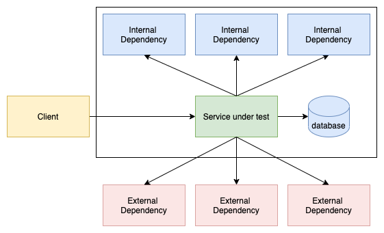
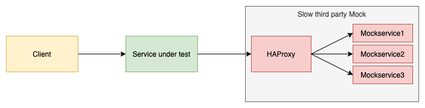
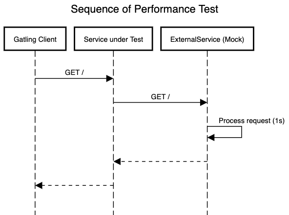
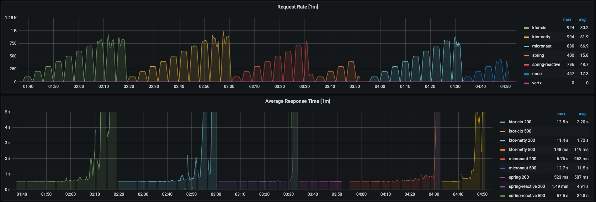
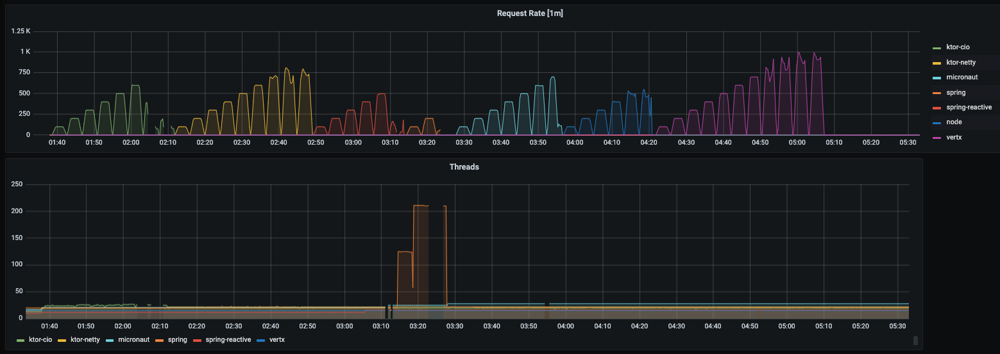

# Comparing the Performance of Frameworks for JVM Backend Services

This repository serves as base for a blog entry. If you want to retrace the explained testing result
see [this chapter.](#how-to-execute-the-test--not-part-of-blog-entry)

## Motivation

What is the performance of a backend service? Every application is developed to serve a certain purpose which in most
cases consists of processing tasks. These tasks can be of various types, like processing data or serving network
requests. Based on that we can define the performance of an application as the amount of workload it can handle in a
given time interval depending on the consumed or needed resources.

During the development of distributed applications, their performance is always a crucial part. Because if an
application is not performing as intended, it is also not fulfilling the purpose it was developed for.

But what to do when an application does not deliver the required performance? What if an application was developed to
process a certain amount of tasks each second, but it simply does not? Or what if the response time of our application
under certain load grows so high that it results in bad user experience or even request timeouts? If you have
encountered such a situation before, some of you may have discussed the following questions:

1. Can we deploy more instances of our application?

   Sometimes this is possible! Especially applications that are developed for cloud infrastructure can be easily scaled
   up and down so that the sum of deployed services has exactly the desired performance. But multiple instances also
   require the multiple of resources and resources are expensive or sometimes not even available. On top of this, this
   solution is not improving the performance of the application itself.

2. Are we able to improve the existing processing logic?

   Is there any potential for parallelization, is there any possibility for caching mechanisms, ...? The refactoring of
   existing logic should be a continuous process during development of any software. This also includes the continuous
   search for performance issues. Each issue you fix and each improvement you make is a future-oriented step and the
   best means when trying to build a long term solution for performance problems. But having to search with limited time
   for possible improvements in a complex system can be a hard, cumbersome and a maybe impossible task.

3. Should we have chosen a different framework 2 years ago, when we have started implementing this application?

   Maybe!

In this article, I want to focus on the third question. How relevant is the choice of a framework when trying to achieve
a certain performance? How big are the differences between currently commonly used frameworks?

## Test setup

The overall setup of this test can be found [here](https://github.com/fkohl04/framework-performance).

Let's think about a possible setup which we can use to compare the performance of different frameworks.

Applications of distributed system are often part of complex service structures. It is very common that a service uses a
database, calls other services that are under our control (Internal Dependency), but also uses endpoints from third
parties which we do not have control over and which can be very slow (External Dependency). We always have to mind that
when measuring the performance of a deployed application we are also measuring all systems the application relies on.



Trying to compare the performance of frameworks in such a system would be very hard, because there are simply too many
parameters. In order to eliminate any side effect and achieve comparability, we will reduce the test setup to the
smallest possible setup that still represents the built-in networking capabilities, used threading models and load
handling capabilities of the tested frameworks. For this, we will reduce the amount of dependencies to a single external
dependency.


The test setup is now simple enough for a comparison. But we also have to make sure that the test is meaningful by
assuring that we are really measuring the performance of the service under test. This performance shall not be
influenced by our test setup:

- The service shall not be influenced by the system it runs on

  If multiple services are deployed in parallel, make sure they are not influencing each other. Repeating certain parts
  of the test with an isolated deployment shows that this is not the case. A performance test consumes a lot
  computational power and memory. The system resources have to be monitored during the test to assure the system or
  computer is not overloaded.

- The service shall not be limited by the performance of the mock service

  Overrating the capabilities of mock services is
  a [known pitfall](https://thatdevopsguy.medium.com/high-performance-mocking-for-load-testing-bd6d69610cc9) for
  performance testing. To overcome this we will do a little technical adjustment and raise the count of instances of the
  mocked service to 3. A load test against the mock service setup assures that it is performant enough to not influence
  the performance of the service under test.



The functionality of the service under test consists of a call to the mocked third party dependency. When called, the
mock service will wait for one second and then respond with a random number. The service under test will forward this
answer.



All services will be started inside a docker container. We will use Gatling as a load testing client. It will call the
service under test with a certain amount of requests per second. Apart from the described functional endpoint that will
be used in the test, each service provides a further endpoint that serves service metrics to a Prometheus client.

## Candidates

I did a survey among my valued colleagues at Senacor to find out, which JVM frameworks they have encountered in
productive systems. To this list I added the JavaScript Runtime Node.js to have a little comparison to the outside of
the JVM world. The focus lies on JVM frameworks, due to the simple fact that I myself mainly worked in projects that
used JVM backend services.

We made our test setup as simple as possible to have fewer parameters and achieve comparability. We are creating our
services under exactly the same principle and will only implement the most simple application serving our needs without
any performance relevant adjustments or improvements. In general, I tried to deduce every service from the
GettingStarted tutorials of the framework websites to get exactly that impression of the service, the framework creators
are presenting.

### Spring

[Spring](https://spring.io/) is one of the most commonly used JVM frameworks, initially released 2002 and open source.
It is available in a blocking servlet stack and a non-blocking reactive stack. We will test both of them separately.

### KTOR

[KTOR](https://ktor.io/) is a framework for asynchronous client and server applications that promises to be lightweight,
flexible, simple and fun. Release of first version in 2018 by Jetbrains. Written completely in Kotlin and built up on
its coroutines. Coroutines are [conceptually similar to threads](https://kotlinlang.org/docs/coroutines-basics.html),
but much more lightweight. Ktor offers the possibility
to [choose the underlying http engine](https://ktor.io/docs/engines.html). We will test it with a Netty and with the
coroutine based CIO Engine.

### Vert.x

[Vert.x](https://vertx.io/) is developed by Eclipse and was published in 2011. It promises to be flexible, resource
efficient and enable writing non-blocking code without unnecessary complexity. Like Node or Spring Reactive, Vert.x
implements the Reactor pattern with an interesting addition: Instead of a single event loop, Vert.x uses multiple and
call this ["Multi-Reactor"](https://vertx.io/docs/vertx-core/java/#_reactor_and_multi_reactor). Vert.x is described as "
a toolkit, not a framework", which underlines its flexibility on the one hand, but also indicates it has to be
configured to a certain degree. Indeed, Vert.x was the only service where I had to do a little performance influencing
adjustment to make it comparable to the other services: Set the number of verticles and set the max connection count of
the HttpClient.

### Micronaut

[Micronaut](https://micronaut.io/) is a framework for light weight and modular applications. It keeps the startup time
and memory footprint low among under methods by avoiding reflection and "ahead of time compilation". It was developed by
the Micronaut Foundation. Their blog also contains
an [entry](https://micronaut.io/2020/04/28/practical-performance-comparison-of-spring-boot-micronaut-1-3-micronaut-2-0/)
about a performance comparison of Micronaut vs. SpringBoot.

Micronaut offers
great [support and instructions](https://guides.micronaut.io/latest/micronaut-creating-first-graal-app.html) on
generating native images. Though, we won't use native images in this comparison, since it would also be possible to
generate those for the other frameworks. This is a topic for a different blog entry :) (
like [this about the theory of native images](https://blog.senacor.com/graalvm-native-images-in-der-theorie/) or this
about [how to build native images in a CI Pipeline](https://blog.senacor.com/graalvm-native-images-fur-deine-ci-pipeline/))
.

### Node

In contrast to all other JVM based frameworks we will also test a [Node.js](https://nodejs.org/en/about/) server which
is an asynchronous and event driven JavaScript runtime. Node implements
the [Reactor pattern](https://en.wikipedia.org/wiki/Reactor_pattern), which means that it uses an "event loop" to
achieve its asynchronous behavior. The special part is that node is executing all computations in a single thread.
However, there is a pool of worker threads that handle time-consuming I/O tasks.
See [here](https://nodejs.org/en/about/)
for more details.

## Test Execution and Results

We will test our candidates in three disciplines

1. How many requests per second can they process without getting unresponsive?
2. How do they behave if the third party system gets slower and slower?
3. What resources are the deployed containers consuming during a test with an average size of load?

### 1. Requests per second

When serving requests that originate from human interactions, there will always be fluctuation in the request rate
depending on the daytime. For example, if you are processing transaction data, you will probably have a peak in your
requests rates during lunchtime. How good are our frameworks at withstanding such peaks in the requests rate?

To test this behavior, the Gatling client calls each service one after another starting with 100 users over three
minutes. If the rate of successful calls is greater than 90% the test will be repeated with user count raised by 100
until the service gets unresponsive. For further details please
the [script that executes the load test](https://github.com/fkohl04/framework-performance/blob/main/performancetest/runTillFailure.sh)
and
the [gatling test](https://github.com/fkohl04/framework-performance/blob/main/performancetest/src/gatling/scala/scenarios/BasicSimulation.scala)
itself.

The focus of this test are the capabilities of the frameworks to handle and process incoming requests in parallel. How
many requests can the frameworks accept per second?

#### Result

| Average response time | 100 | 200 | 300 | 400 |  500 |  600 |  700 |  800 |  900 |  1000 | 1100 |
|-----------------------|:---:|:---:|:---:|:---:|:----:|:----:|:----:|:----:|:----:|:-----:|:----:|
| Vertx                 |  1s |  1s |  1s |  1s |  1s  |  1s  |  1s  | 3.1s | 4.1s | 7.46s |   X  |
| Ktor-Netty            |  1s |  1s |  1s |  1s |  1s  |  1s  | 1.3s | 5.7s |   X  |       |      |
| Ktor-CIO              |  1s |  1s |  1s |  1s |  1s  | 1.1s |   X  |      |      |       |      |
| Micronaut             |  1s |  1s |  1s |  1s |  1s  | 1.4s |   X  |      |      |       |      |
| Node                  |  1s |  1s |  1s |  1s |  2.9 |   X  |      |      |      |       |      |
| Spring-Reactive       |  1s |  1s |  1s |  1s | 2.1s |   X  |      |      |      |       |      |
| Spring                |  1s |  1s |  X  |     |      |      |      |      |      |       |      |



#### Observations & Conclusions

When a service is able to handle a certain user count, the response time is near to the configured delay of the
mockservice (i.e. one second). Before a service becomes unresponsive it can be observed that the response times are
increasing drastically and the request rate drops.

**The Spring Service** is the only one working with a blocking threading model. Each incoming call is processed by a
dedicated JVM thread, which can nicely be observed in the Grafana dashboard.



The underlying Tomcat http engine works with a fixed count of 200 threads. With this given, it is logical that it can
serve 200 requests per second. So why not simply raising the count of threads? On the one hand, we want to compare the
frameworks without any performance relevant adjustments. When working with such a service you have to decide before
deployment what the maximal thread count shall be. The service is not scaling automatically when the request count gets
higher than initially expected. On the other hand, raising the thread count is also in general not the perfect solution
for performance problems, because maintaining threads always costs resources. More details about this will be provided
in the third test.

For **all other services** it is clearly visible that they are working with a non-blocking threading model since the
requests rate is much higher than the count of active threads would allow it to be. This seems to work a bit better for
micronaut and ktor than for spring reactive and node. Vertx is the clear winner of this test. At 700 req/sec it still
responds nearly as fast as the mocked service. With higher request counts the response times of Vertx get noticeably
higher, but it stays responsive up until impressing 1000 req/sec.

### 2. Very slow third party systems

Sometimes, third party systems are quite unreliable. It may occur that they are not available or all, or they get very,
very slow. Which framework is best equipped to deal with this sort of problem?

For this test we will adjust our mock services to have a larger delay that in the other tests. Starting at 1 seconds and
up to 8 seconds. For each duration, the Gatling client will call the services for three minutes with 100 req / sec.

The focus of this test is task handling. Over three minutes more requests are reaching the service than can be
processed. How good are the frameworks able to handle this piling of tasks?

#### Result

| Average response time | 1s | 2s | 4s | 6s  | 8s |
|-----------------------|----|----|----|-----|----|
| Vertx                 | 1s | 2s | 4s | 6s  | 8s |
| Ktor-Netty            | 1s | 2s | 4s | 6s  | 8s |
| Ktor-CIO              | 1s | 2s | 4s | 6s  | 8s |
| Micronaut             | 1s | 2s | 4s | 6s  | 8s |
| Node                  | 1s | 2s | 4s | 6s  | 8s |
| Spring-Reactive       | 1s | 2s | 4s | 15s | X  |
| Spring                | 1s | 2s | X  |     |    |

#### Observations & Conclusions

Again the result for the Spring service is very logical. With 100 requests per second, each taking 2 seconds to be
processed all 200 threads will always be working. When raising the delay any further, the service will not be able to
respond to all clients. Interestingly Spring Reactive as an asynchronous framework that should be able to handle many
tasks in parallel also got noticeably slower and later unresponsive at a delay of 6 seconds and higher. All other
frameworks did not show a reaction at all.

### 3. Resource consumption

The resource consumption is a critical part of each service. When deploying to a cloud environment the consumed
resources can be directly translated into costs. When working with on premise infrastructure it can occur that the
available resources for the service are limited and I have to make sure that the service is able to work with these
boundaries.

The Gatling client will call each service one after another with a certain rate of calls per second over three minutes.
We are using [cadvisor](https://github.com/google/cadvisor) which exposes metrics about active containers as prometheus
metrics, to compare the resource consumption of the different containers. Before each test we will restart all
containers, so that the resource metrics are not influenced by earlier executions. Please note: For this very test we
raised the thread count of the spring service to 500. All values are means over multiple test runs.

#### Result

| CPU Time        | 200 req/sec | 400 req/sec | 500 req/sec |
|-----------------|:-----------:|:-----------:|:-----------:|
| Vertx           |    32.6 s   |   43.4 s    |   1.14 min  |
| Ktor-Netty      |   1.22 min  |   1.82 min  |   2.52 min  |
| Ktor-CIO        |   1.33 min  |   2.89 min  |   2.72 min  |
| Micronaut       |   1.33 min  |   1.74 min  |   2.53 min  |
| Node            |    57.3 s   |   2.02 min  |   2.87 min  |
| Spring-Reactive |   1.17 min  |   1.51 min  |   2.62 min  |
| Spring          |   1.20 min  |   1.82 min  |   2.38 min  |

| Max memory usage | 200 req/sec | 400 req/sec | 500 req/sec |
|------------------|:-----------:|:-----------:|:-----------:|
| Vertx            |   376 MiB   |   385 MiB   |   424 MiB   |
| Ktor-Netty       |   405 MiB   |   434 MiB   |   510 MiB   |
| Ktor-CIO         |   417 MiB   |   604 MiB   |   898 MiB   |
| Micronaut        |   472 MiB   |   500 MiB   |   510 MiB   |
| Node             |    93 MiB   |   113 MiB   |   391 MiB   |
| Spring-Reactive  |   600 MiB   |   680 MiB   |   1.05 GiB  |
| Spring           |   596 MiB   |   910 MiB   |   1.09 GiB  |

#### Observations & Conclusions

The Vertx services requires the fewest CPU computation time, while all other services require about the same. The CPU
computation advantage of Vertx can only be attributed to efficient processing of the requests, since in general all
services had to process the same logic.

Especially for lower request rates, the node service requires less memory than all the JVM frameworks. That is not
surprising since the Java Runtime Environment is bigger than the Node Runtime. Depending on the scenario, this could be
a big advantage. For example, with the same memory one could host more instances of node containers than of JVM
containers.

Note: We have to be careful when comparing memory consumption of JVM services, because the JVM pre-allocates memory it
does not actually use. Therefore, we are not measuring the memory allocated by the JVM, but the memory consumed by the
whole container, which turned out to be a more meaningful metric.

For each request count, spring-reactive and especially spring consume more memory that all other frameworks. At 500 req
/ sec each consumes nearly double the amount of the other frameworks with KTOR-CIO being an exception.

## Resume

After all these numbers let us come back to our initial question. Many questions during the development of software can
not be answered generally and are very dependent on the use case. Which framework to use and whether to use a
non-blocking or a blocking one is surely one of them. But no worries, the question we want to answer is a different one:
Are there differences between the performance of currently commonly used (JVM) frameworks? This question we can answer
with a definitive: Yes!

Especially when you have strict requirements like

- a high request load
- slow third party dependencies
- limited resources

the choice of a framework can make a big difference. A non-blocking framework is not the one golden solution for all
these challenges, but surely some of them are easier to overcome when choosing one.

### So which framework to choose?

Of course, the performance of a framework is not the only criteria when deciding which one fits best your situation or
use case. For example, the skill set and the experience of the team should affect the decision as much as a technical
requirement. However, in each scenario you should at least think about the performance requirements before committing to
a framework.

When you know beforehand that the service will not have to face any of the performance related requirements listed above
Spring MVC is still a pretty solid choice. Spring has a huge community and you will find help for any of you questions
very fast.

If you are used to the Spring world and want to stick to it, but also want to use some benefits of asynchronous
programming, Spring Reactive is definitely worth a try. Especially because you can simply reuse certain Spring modules,
like SpringSecurity, that you may already have implemented for the blocking Spring stack, an own trial and comparison
can be quickly achieved. How to avoid the complex syntax for asynchronous code that comes with Spring Reactive by using
Kotlin Coroutines is described in [the next chapter](#one-last-word-about-asynchronous-frameworks-and-programming).

In case you really need a high performant JVM solution, Spring Reactive may not be enough. In that case you should take
a look at Vertx, which performed excellent in our tests. As said before: Be aware, that Vertx is described as a toolkit,
not as a framework. This means you will have to configure certain things on your own, that you are maybe used to get
delivered in other frameworks.

Micronaut, Ktor and Node also produced pretty impressing results in our test and can be seen to be on the middle ground
between the other solutions. They are fully supported frameworks and have also proven that they are capable to result in
high performant services.

### One last word about asynchronous frameworks and programming

An often read counterargument against reactive programming and non-blocking frameworks is, that the code becomes hard to
read, to maintain and to understand. And this may be true, when one tries to write
[stream-like instructions](spring-webflux/src/main/kotlin/spring/demo/demo/controller/Controller.kt) for the publisher
schema of Spring-Reactive. At that point I want to emphasize an in my opinion big advantage of Kotlin and its
coroutines:
the asynchronous/non-blocking code
looks [nearly like synchronous/blocking code](https://kotlinlang.org/docs/async-programming.html#coroutines). You don't
have to learn or get used to completely new patterns, but can just write code that is easy to read and has the potential
to deliver a high performant result by being asynchronous. As written above, Ktor is written completely in Kotlin and
built upon coroutines. But also all the other presented frameworks have a support for Kotlin + coroutines.
[Here is a great article](https://medium.com/androiddevelopers/the-suspend-modifier-under-the-hood-b7ce46af624f), if you
want to understand how coroutines are working "under the hood".

## How to execute the test ( Not part of blog entry)

All tested services are available as docker containers. To start the test environment, build all jars by executing

```shell
./gradlew build 
```

and then build the docker images and start the containers by running the [docker-compose file](docker-compose.yml).

The performance test used in this article is the gatling
simulation [ConstantReqPerSecSimulation](performancetest/src/gatling/scala/scenarios/ConstantReqPerSecSimulation.scala).
To test all applications one after another with different user counts you can use the
script [runAllTest.sh](performancetest/runAllTest.sh).
