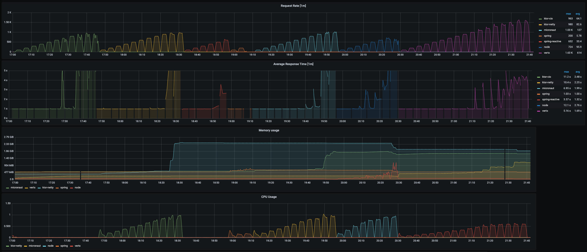

# framework-performance

This repository serves as base for a blog entry. If you want to retrace the explained testing result see [this chapter.](#how-to-execute-the-test--not-part-of-blog-entry)

## Motivation

During the development of distributed applications their performance is always a crucial part. Every application is
developed to serve a certain purpose which in most cases consists of processing tasks. These tasks can be of various
types, like processing data or serving network requests. In all cases we can regard the performance of an application as
the amount of workload it can handle in a given time interval depending on the consumed or needed resources.

A performant application needs less time and resources as a not performant application, which results in saving money
and computational resources. In the case of an application serving web requests its performance is in most cases
equivalent to the response time of the application, which is a crucial part of the user experience.

What to do when an application does not deliver the required performance? Let's imagine an application was developed to
process a certain amount of tasks each second, but it simply does not. Or the response time of our application is so
high that it results in bad user experience. If you have encountered such a situation before, some of you may have
discussed the following questions:

1. Can we deploy more instances of our application?

   Sometimes this is possible! Especially applications that are developed for cloud infrastructure can be easily scaled
   up and down so that the sum of deployed application has exactly the desired performance. But multiple instances also
   require the multiple of resources and resources are expensive or sometimes not even available. On top of this, this
   solution is not improving the performance of the application itself.

2. Are we able to improve the existing processing logic?

   Is there any potential for parallelization, is there any possibility for caching mechanisms, ...? The refactoring of
   existing logic should be a continuous process during development of any software. This refactoring also includes
   performance relevant improvements. Each improvement is future-oriented and improving logic is the best means when
   trying to build a long term solution for performance problems. But having to search with limited time for possible
   improvements in a complex system can be a hard, cumbersome and a maybe impossible task.

3. Should we have chosen a different framework 2 years ago, when we have started implementing this application?

   Maybe!

In this article, we want to investigate and concentrate on the third question. How relevant is the chose of a framework
when trying to achieve a certain performance? How big are the differences between currently commonly used frameworks?

## Test setup

### System

Let's think about a possible setup which we can use to compare the performance of different frameworks.

Applications of distributed system are often part of complex service structures. It is very common that a service uses a
database, calls other services that are under our control (Internal Dependency), but also uses endpoints from third
parties which we do not have control over (External Dependency). We always have to mind that when measuring the
performance of a deployed application we are also measuring all systems the application relies on.

Trying to compare the performance of frameworks in such a system would be very hard, because there are simply too many
parameters. In order to eliminate any side effect and achieve comparability, we will reduce the test setup to the
smallest possible constellation that still represents the built-in networking capabilities, used threading models and
load handling capabilities of the tested frameworks. For this we will reduce the count of dependencies to a single
external dependency.

The test setup is now easy enough for a comparison, but we have to do a little technical adjustment. Since we want to
test the performance of the "Service under test" we have to make sure, that the performance is not influenced or limited
by the performance of the mock service. We can easily exclude this source of errors, by raising the count of instances
of the mocked service.

We will use Gatling as a load testing client. It will call the service under test with a certain amount of requests per
second.

The functionality of the service under test consists of a call to a service that shall mock a third party dependency.
When called, the mock service will wait for 500ms and then respond with a random number.

Apart from the described functional endpoint that will be used in the test each service provides a further endpoint to
provide service metrics to a Prometheus client.

### Test parameters

All services will be started inside a docker container. The Gatling client will call each service one after another
starting with 100 and up to 1000 users taking steps of 100 users. For further details please
the [script that executes the load test](https://github.com/fkohl04/framework-performance/blob/main/performancetest/runAllTest.sh)
and
the [gatling test](https://github.com/fkohl04/framework-performance/blob/main/performancetest/src/gatling/scala/scenarios/BasicSimulation.scala)
itself.

## Candidates

### Spring

Spring is one of the most commonly used JVM frameworks, initially released 2002 and open source.
https://spring.io/
It is available as in a blocking servlet stack and a non-blocking reactive stack. We will test both of them separately.

### KTOR

Framework for asynchronous client and server applications that promises to be lightweight, flexible, simple and fun.
Release of first version in 2018 by Jetbrains. https://ktor.io/
Written completely in Kotlin and built up on its coroutines. Ktor offers the possibility to choose the underlying http
engine. We will test it with a Netty and with the coroutine based CIO Engine https://ktor.io/docs/engines.html

### Vertx

Vertx is a very young framework, developed by eclipse and initially released in 2021 https://vertx.io/. It promises to
be flexible, resource efficient and enable writing non-blocking code without unnecessary complexity.

### Micronaut

Micronaut is a framework for lightweigt and modular applications. It keeps the startup time and memory footprint low
among under things by avoiding reflection Developed by the Micronaut Foundation https://micronaut.io/

### Node

In contrast to all other JVM based frameworks we will also test a [Node.js](https://nodejs.org/en/about/) server which
is asynchronous and event driven JavaScript runtime.

## Result

### Observations

1. A service is able to handle a certain user count without visible restrictions if the response time is near to 500ms
   and the request rate is near to the count of requests per second. Before a service becomes unresponsive it can be
   observed that the response times are raising strongly and the request rate drops.
2. For the Spring service the thread count is equal to the requests rate during all successful test runs. For all other
   services the JVM thread count is nearly not changing during the test.
3. Spring and Node.js are collapsing at 500 users, Spring-Reactive at 800, micronaut at 900 and both ktor services can
   serve up to 1000 users
4. The performance of both KTOR service is very similar

### Reasoning

The Spring Service is the only one working with a blocking thread model. Each incoming call is processed by dedicated
JVM thread. The underlying Tomcat http engine works with a fixed count of 200 threads. With this it is just logical and
nice to observe in the diagram that it can serve 200 threads / 0.5 seconds of blocking a thread per request = 400
requests per second. Then why not just raising the count of threads? Of course each thread costs resources and we can
see that the service is already consuming as many resources as the other services.

For all other services it is clearly visible that they are working with a non-blocking threading model since the
requests rate is much higher than the count of active threads would allow it to be in regard of the sleeping time of the
slow third party mock.

Under the non-blocking services both KTOR services are standing out. It is hard to proof what exactly leads to the
different in the result, but it is probable that the most obvious difference in the frameworks is leading to this
difference in the result: [Coroutines](https://kotlinlang.org/docs/coroutines-overview.html). KTOR is completely written
in Kotlin and uses coroutines from bottom up, in contrast to the other frameworks that can also use coroutines, but are
under the hood based on other threading models.

<!--- Todo Node hervorheben, dass Node servcer wenig speicher verbraucht -->

## Resume

The result of our investigation is simple: If you need to build an application that has to be able to process a
high amount of requests, and you have the possibility to, choose an asynchronous framework!

All the investigated asynchronous frameworks promised that they would process more with less resources. And this is
exactly what our investigations could verify: With a fixed set of resources and without any optimizations the
non-blocking frameworks could process a multiple of requests a blocking framework could process.

A counterargument against reactive programming and non-blocking framework is, that the code becomes hard to read, to
maintain and to understand. And this may be true, when one tries to write stream-like instructions for the publisher
schema of Spring-Reactive. But also in this category a big advantage of Kotlin and its coroutines is revealed: the
asynchronous code looks [nearly like synchronous code](https://kotlinlang.org/docs/async-programming.html#coroutines).
You don't have to learn or get used to completely new patterns, but can just write code that is easy to read and has the
potential to deliver a high performant result by being asynchronous.

## How to execute the test ( Not part of blog entry)

All tested services are available as docker containers. To start the test environment, simply start
the [docker-compose file](docker-compose.yml).

The performance test used in this article is the gatling
simulation [ConstantReqPerSecSimulation](performancetest/src/gatling/scala/scenarios/ConstantReqPerSecSimulation.scala).
To test all applications one after another with different user counts you can use the
script [runAllTest.sh](performancetest/runAllTest.sh).
